# BillZest FinTrack — React Native System & UI Flows
> **Version**: 2.0  
> **Date**: 2026-06-13  
> **Source of Truth**: `billzest_fin/` web app + `latest-sql-dump.sql`

---

## 1. Product Architecture Flow

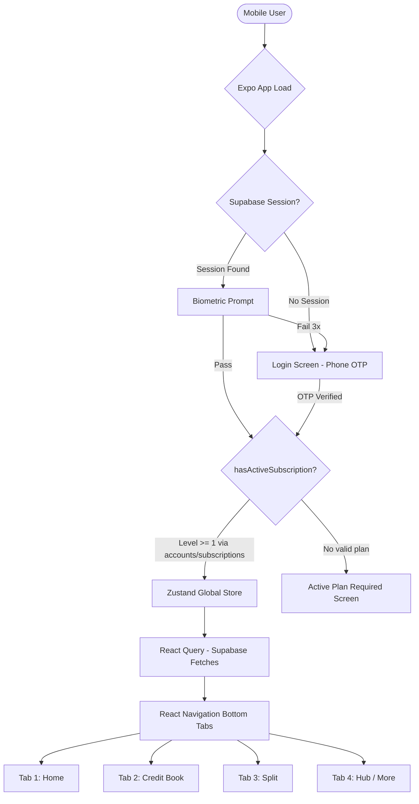

---

## 2. Subscription Gate Logic Flow

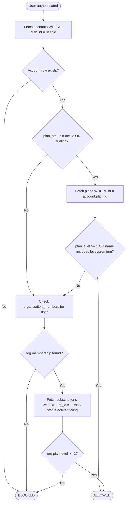

---

## 3. Navigational Architecture

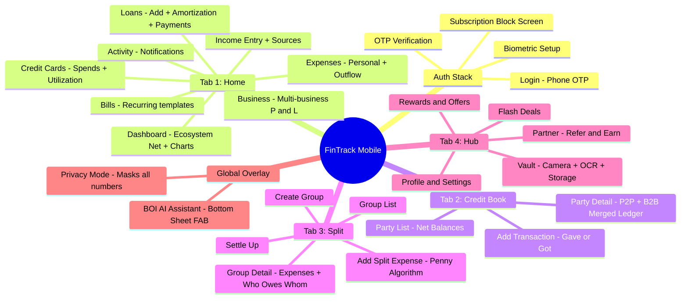

---

## 4. Read Data Flow (Supabase -> UI)

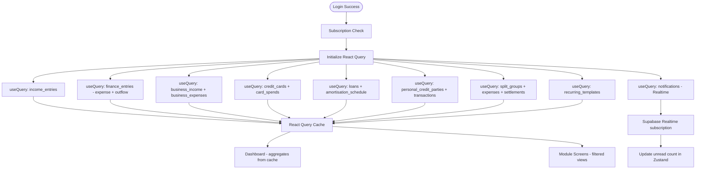

---

## 5. Write Data Flow (UI -> Supabase)

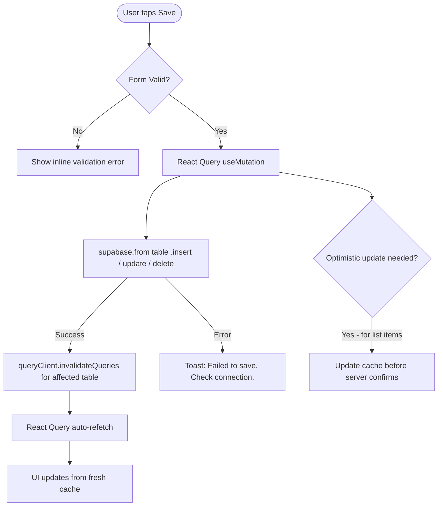

---

## 6. Module Flows

### 6.1. Add Income Flow
```
IncomePage
  -> Tap Add (+)
  -> IncomeFormSheet opens
  -> Select source from finance_categories WHERE context='income'
  -> Enter amount, date, notes
  -> Tap Save
  -> supabase.from('income_entries').insert({source_id, entry_date, amount, notes})
  -> Invalidate income_entries query
  -> Sheet closes, list refreshes, toast "Income added"
```

### 6.2. Add Personal Expense Flow
```
ExpensesPage
  -> Tap Add
  -> ExpenseFormSheet opens
  -> Select category from finance_categories WHERE context='expense'
  -> Enter amount, date, label, optional receipt (camera/gallery)
  -> If receipt: upload to fintrack_vault, get URL
  -> supabase.from('finance_entries').insert({context:'expense', category_id, entry_date, amount, receipt_url, ...})
  -> Invalidate finance_entries query
  -> Dashboard Ecosystem Net re-calculates
```

### 6.3. Add Loan + Generate Amortization
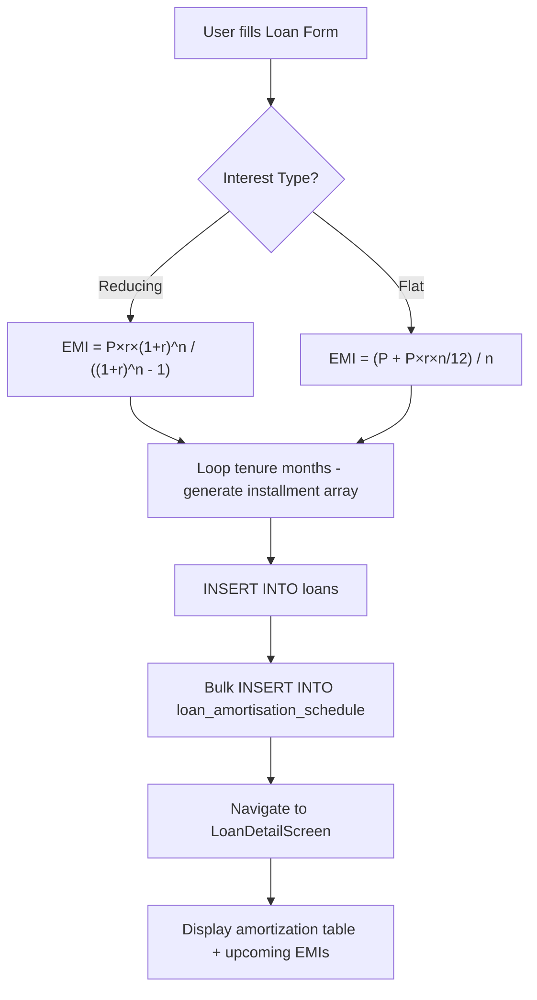

### 6.4. Part Payment Flow
```
LoanDetailScreen -> Tap Part Payment
  -> Enter amount, payment mode, date
  -> Choose impact: reduce_emi OR reduce_tenure
  -> Recalculate remaining schedule from current month onward
  -> INSERT INTO loan_part_payments
  -> UPDATE remaining loan_amortisation_schedule rows
  -> Invalidate loan queries
  -> Show updated schedule + "Months saved: X, Interest saved: Rs.Y"
```

### 6.5. Credit Book — Add Transaction
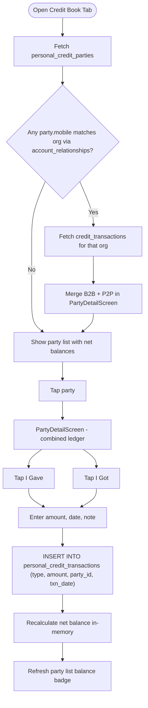

### 6.6. Expense Split — Penny Algorithm
```mermaid
flowchart TD
    AddExp[User submits split expense] --> SelectMode{Split Mode?}
    
    SelectMode --> Equal[Equal]
    SelectMode --> Percent[Percent]
    SelectMode --> Manual[Manual / Exact]
    
    Equal --> CalcBase["base = floor(total / count * 100) / 100"]
    CalcBase --> CalcRemainder["remainder = total - (base * count)"]
    CalcRemainder --> AssignFirst["participants[0].share += remainder"]
    AssignFirst --> Validate
    
    Percent --> CalcPct["share_i = round(total * pct_i / 100 * 100) / 100"]
    CalcPct --> PctRemainder["remainder = total - SUM(shares)"]
    PctRemainder --> AssignLast["participants[last].share += remainder"]
    AssignLast --> Validate
    
    Manual --> Validate{SUM(shares) == total?}
    Validate -->|No| BlockError[Block Save - show validation error]
    Validate -->|Yes| InsertExpense["INSERT INTO split_expenses"]
    InsertExpense --> InsertParticipants["Bulk INSERT INTO split_expense_participants"]
    InsertParticipants --> RecalcDebts[Recalculate who owes whom in-memory]
```

### 6.7. Split Settlement Flow
```
GroupDetailScreen -> Tap Settle Up
  -> Calculate simplified debts (minimized transactions algorithm)
  -> Show list: "Rahul pays You Rs.500"
  -> User confirms one settlement
  -> Validate: amount <= amount owed
  -> INSERT INTO split_settlements (payer_id, receiver_id, receiver_mob, amount, method, group_id)
  -> Recalculate group balance
  -> Toast "Settlement recorded"

NOTE: settlements go to split_settlements ONLY - NOT to personal_credit_transactions
```

### 6.8. Vault — Receipt Upload
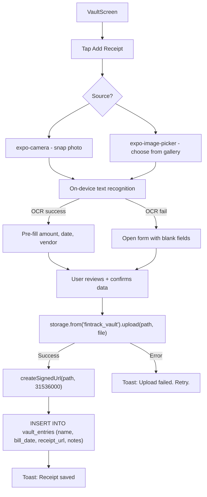

### 6.9. BOI AI Assistant Flow
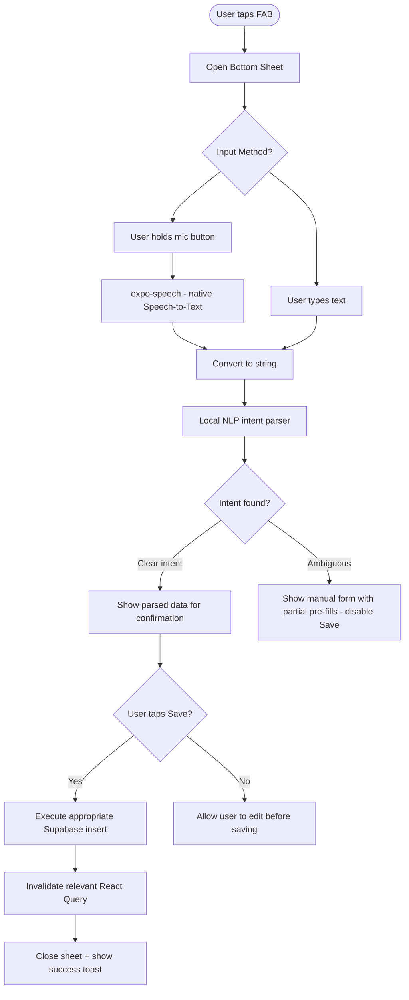

---

## 7. CRUD Flows Matrix

| Entity | Create | Read | Update | Delete | Validations |
|--------|--------|------|--------|--------|-------------|
| **Income Entry** | Form + source select | List sorted by date | Edit amount/date/source | Delete by id | amount > 0, source required |
| **Personal Expense** | Form + category select + receipt | List by date | Edit all fields | Delete by id | amount > 0, category required |
| **Business** | Name + description | Switcher list | Edit name | Soft delete (is_active=false) | Name required |
| **Business Income/Expense** | Form per business | Filtered by business_id | Edit | Delete | amount > 0 |
| **Credit Card** | Form: name, bank, last4, limit | Card list | Edit details | Delete card | last4 <= 4 chars |
| **Card Spend** | Form: card, date, merchant, amount | Filtered by card + billing cycle | Edit | Delete | amount > 0, card required |
| **Loan** | Full form + EMI calculation + schedule generation | List + detail with schedule | Log payments only | Mark closed | Formula validation |
| **Recurring Template** | Title + amount + frequency + next_due | Sorted by next_due | Edit | is_active=false | frequency required |
| **Credit Party** | Name + mobile | List with net balances | Edit name/notes | Soft delete | Mobile unique per user |
| **Credit Transaction** | Gave or Got + amount | Party detail ledger | Not supported | Not supported | amount > 0 |
| **Split Group** | Name + type + members | Group list | Add/remove members | Archive | Min 1 member |
| **Split Expense** | Full form + penny algorithm | Group ledger | Not supported after create | Delete group expense | SUM(shares) == total |
| **Split Settlement** | Confirm amount + method | Included in balance calc | Not supported | Not supported | amount <= owed |
| **Vault Entry** | Camera + upload + DB insert | Grid thumbnail view | Edit name/notes | Delete (and storage object) | Upload must succeed first |

---

## 8. State Flows

### 8.1. Loan Lifecycle
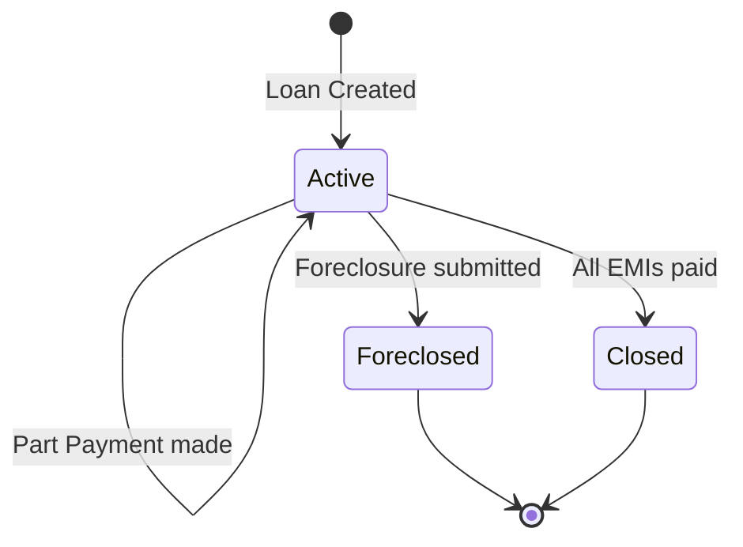

### 8.2. Privacy Mode
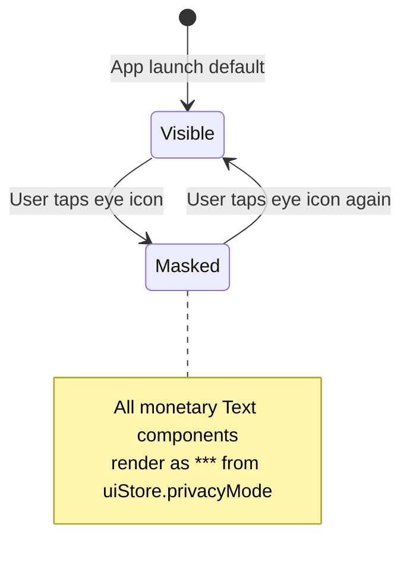

### 8.3. Split Expense Participant
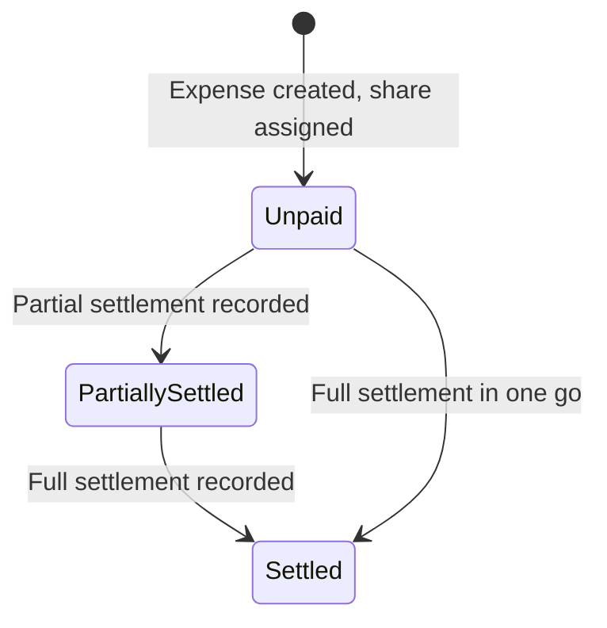

---

## 9. Error & Edge Case Flows

| Module | Edge Case | Handling |
|--------|----------|---------|
| Auth | OTP not received | Resend button active after 30s countdown |
| Auth | Biometric fails 3 times | Fall back to OTP screen |
| Auth | Plan expired mid-session | On next launch: show block screen |
| Split | Equal split with rounding | Penny to participants[0] (first in list) |
| Split | Manual split doesn't equal total | Block Save button, show error per participant |
| Split | Member removed with balance | OPEN QUESTION: soft-delete or block? |
| Loans | Part payment > outstanding balance | Validate: amount <= outstanding_principal |
| Credit Book | Same mobile added twice | Toast "Contact exists" + link to existing party |
| Vault | Image > 10MB | Show file size error before attempting upload |
| Vault | Upload fails mid-way | Do NOT insert DB row. Toast + retry button. |
| Dashboard | No data (new user) | Show onboarding tips / empty state with add CTAs |
| Bills | Recurring template overdue | Auto-process on app open, show overdue badge |
| BOI | Voice command unclear | Partial pre-fill, disable Save until user completes form |

---

## 10. Development Dependency Graph

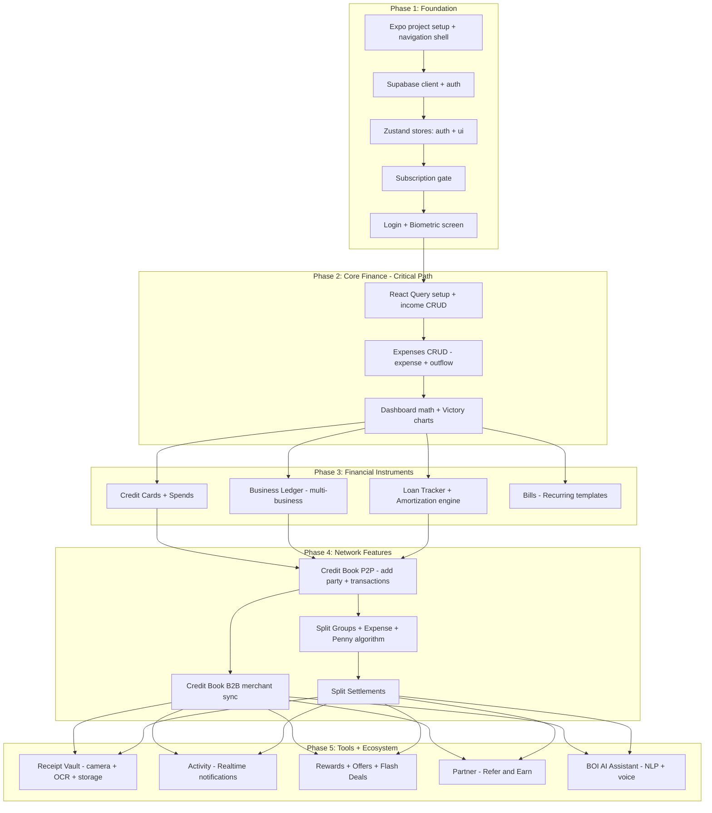
